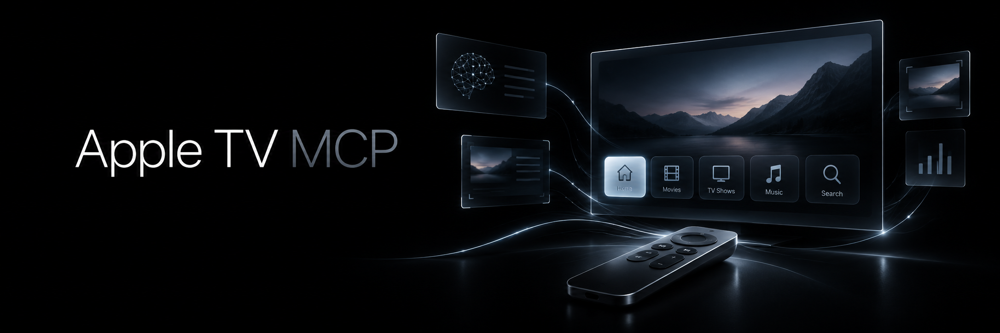

<!-- mcp-name: io.github.trevor-nichols/appletv-mcp -->

# Apple TV MCP: A local MCP server that lets AI agents control — and see — your Apple TV

<p align="center">
  
</p>

Open apps, navigate tvOS, control playback, type searches, adjust volume, manage power, and take screenshots so a multimodal agent can actually inspect what happened.

```text
You:
Open YouTube and search for OpenAI.

Agent:
→ opens YouTube
→ takes a screenshot
→ sees the current interface
→ navigates to Search
→ types "OpenAI"
→ takes another screenshot
→ verifies the results
```

Apple TV MCP turns your Apple TV into a locally controlled, visually observable device for MCP-capable AI agents.

No hosted backend. No custom Apple TV app. No cloud account.

---

## Why Apple TV MCP?

Most Apple TV automation is blind.

A script can press Right or Select, but it usually has no idea what appeared on the screen afterward.

Apple TV MCP combines **semantic control** with **point-in-time visual observation**.

| Traditional Apple TV automation  | Apple TV MCP                                                |
| -------------------------------- | ----------------------------------------------------------- |
| Send blind remote commands       | Take screenshots between actions                            |
| Build app-specific scripts       | Navigate arbitrary tvOS interfaces                          |
| Guess whether an action worked   | Inspect the screen and verify                               |
| Custom integration per AI system | Standard MCP tool interface                                 |
| Remote commands only             | Apps, playback, text, power, volume, navigation, and vision |

The result is a feedback loop an AI agent can actually use:

```text
screenshot
    ↓
model sees tvOS
    ↓
chooses an action
    ↓
press / type / open
    ↓
screenshot again
    ↓
verify
```

Semantic tools are still preferred whenever possible. Screenshots make the difference when the task requires navigating an interface that does not expose a direct API.

---

## Install in seconds

Apple TV MCP requires Python 3.14.

### Recommended

```bash
uv tool install appletv-mcp
```

Or:

```bash
pipx install appletv-mcp
```

Then pair your Apple TV:

```bash
atvremote wizard
```

Configure Apple TV MCP:

```bash
appletv-mcp configure
```

Check the setup:

```bash
appletv-mcp doctor
```

And start the MCP server:

```bash
appletv-mcp serve
```

### From source

```bash
git clone https://github.com/trevor-nichols/appletv-mcp.git
cd appletv-mcp
uv sync --locked
uv run appletv-mcp configure
uv run appletv-mcp doctor
uv run appletv-mcp serve
```

---

## What can it do?

Apple TV MCP exposes fourteen tools grouped around what an agent actually wants to accomplish.

### See

* Take a screenshot of the current Apple TV screen
* Read device, connection, playback, and media state
* Inspect available Apple TV capabilities

### Apps

* List installed applications
* Open an application by name
* Open an application by bundle identifier
* Open deep links and custom application URLs

### Navigate

* Up
* Down
* Left
* Right
* Select
* Back
* Home
* Menu
* Other supported remote actions

Remote navigation is intentionally treated as non-idempotent. Apple TV MCP does not blindly replay navigation commands after an uncertain connection failure.

### Playback

* Play
* Pause
* Toggle play/pause
* Stop
* Next
* Previous
* Seek to an absolute position
* Skip forward or backward

### Text

Type directly into a focused tvOS text field.

This is useful for:

* Search
* Usernames
* App navigation
* Query entry

### Volume

* Read volume when available
* Set an absolute volume level
* Adjust volume relatively

### Power

* Turn the Apple TV on
* Turn the Apple TV off

Power operations use different retry semantics so a reconnect attempt cannot accidentally wake a device immediately after a successful power-off command.

---

## Give your agent eyes

The optional screenshot backend is what makes Apple TV MCP more than a remote control.

The MCP tool:

```text
apple_tv_screenshot
```

returns the current Apple TV screen as native MCP image content.

That means a multimodal MCP client can call the tool and inspect the returned image directly.

For example:

```text
Agent:
apple_tv_screenshot()

→ sees the Apple TV Home Screen
→ sees YouTube highlighted

apple_tv_press(button="select")

apple_tv_screenshot()

→ sees the YouTube interface
```

The model does not need access to a local `screen.png` path and does not receive base64 inside a text response.

The PNG itself is returned through MCP.

### Screenshots are point-in-time

Apple TV MCP does **not** continuously watch the screen.

A screenshot describes what was rendered at the moment it was captured.

If the agent performs another action afterward, the previous screenshot may already be stale.

The intended pattern is:

```text
observe
→ act
→ observe
→ verify
```

---

## Enable screenshots

Screenshot support is optional.

Apple TV control continues to work normally without it.

Install the separate helper:

```bash
uv tool install appletv-screenshot
```

The screenshot system uses a separate Apple developer / RemoteXPC pairing from the pairing used by `pyatv`.

Pair for developer access:

```bash
pymobiledevice3 remote pair
```

Then configure the screenshot helper for one Apple TV:

```bash
appletv-screenshot configure --udid <UDID>
```

Verify everything together:

```bash
appletv-mcp doctor
```

A healthy installation will report both Apple TV control and screen capture.

The screenshot helper has its own configuration, dependencies, and lifecycle. `pymobiledevice3` is not imported by the main `appletv-mcp` package.

For deeper screenshot setup and transport troubleshooting, see:

```text
sidecars/appletv-screenshot/README.md
```

---

## Quick start

The complete happy path is:

```bash
# Install
uv tool install appletv-mcp

# Pair for Apple TV control
atvremote wizard

# Choose the Apple TV
appletv-mcp configure

# Optional: install visual observation
uv tool install appletv-screenshot

# Optional: developer pairing for screenshots
pymobiledevice3 remote pair
appletv-screenshot configure --udid <UDID>

# Verify
appletv-mcp doctor

# Run the MCP server
appletv-mcp serve
```

---

## Connect your MCP client

Apple TV MCP uses local **stdio MCP transport**.

Any MCP client capable of launching a local stdio server can use it.

A typical configuration looks like:

```json
{
  "mcpServers": {
    "appletv-mcp": {
      "command": "appletv-mcp",
      "args": ["serve"]
    }
  }
}
```

If Apple TV MCP is running from a cloned repository instead:

```json
{
  "mcpServers": {
    "appletv-mcp": {
      "command": "uv",
      "args": [
        "--directory",
        "/absolute/path/to/appletv-mcp",
        "run",
        "appletv-mcp",
        "serve"
      ]
    }
  }
}
```

The server does not expose an HTTP endpoint and does not require OAuth.

---

## Tools

| Tool                     | Purpose                                    |
| ------------------------ | ------------------------------------------ |
| `apple_tv_status`        | Read structured device and playback state  |
| `apple_tv_capabilities`  | Inspect normalized feature availability    |
| `apple_tv_list_apps`     | List launchable applications               |
| `apple_tv_power`         | Turn the Apple TV on or off                |
| `apple_tv_open_app`      | Open an application                        |
| `apple_tv_open_url`      | Open a URL or deep link                    |
| `apple_tv_press`         | Press Apple TV remote buttons              |
| `apple_tv_playback`      | Control playback                           |
| `apple_tv_seek`          | Seek to an absolute playback position      |
| `apple_tv_skip`          | Skip forward or backward                   |
| `apple_tv_set_text`      | Replace focused keyboard text              |
| `apple_tv_set_volume`    | Set an absolute volume                     |
| `apple_tv_adjust_volume` | Adjust volume relatively                   |
| `apple_tv_screenshot`    | Return one screenshot as MCP image content |

The screenshot tool is the only tool that returns image content rather than a structured result.

---

## How it works

Apple TV MCP keeps control and visual observation intentionally separate.

```text
                         AI Agent
                            │
                            ▼
                      Apple TV MCP
                      /           \
                     /             \
                    ▼               ▼
              semantic control   screen capture
                    │               │
                  pyatv      appletv-screenshot
                    │               │
                    │         pymobiledevice3
                    │               │
                    │          RemoteXPC / DVT
                    │               │
                    └──── Apple TV ─┘
```

### Control

Apple TV control is provided through `pyatv`.

Apple TV MCP adds a semantic application layer on top for:

* deterministic app resolution
* capability checking
* connection lifecycle
* safe retry behavior
* non-idempotent command protection
* normalized MCP results

The stable Apple TV identifier is authoritative.

The last known IP address is only an optimization. If the Apple TV changes addresses, Apple TV MCP can rediscover it by identifier and update the preferred host.

### Vision

Screenshots use the separate `appletv-screenshot` helper.

The helper uses `pymobiledevice3` to reach Apple's developer services over RemoteXPC and request a screenshot through DVT.

Its default transport strategy is:

```text
macOS:
native → userspace → tunneld

Linux / Windows:
userspace → tunneld
```

The normal Wi-Fi userspace path does not require root or a permanently running tunnel daemon.

The helper exists as a separate process so its protocol stack, dependencies, pairing records, and failure modes remain isolated from Apple TV control.

`pymobiledevice3` is confined to the separately distributed `appletv-screenshot` helper. The main `appletv-mcp` package does not import or bundle it; the two processes communicate through a narrow command-line/file contract.

---

## Designed for agents

The MCP interface intentionally exposes semantic operations rather than raw Apple protocols.

An agent should think:

```text
open YouTube
pause playback
seek to 2:00
type "Severance"
set volume to 35%
take a screenshot
```

not:

```text
send Companion command
call MRP endpoint
construct RemoteXPC request
```

When a semantic operation exists, use it.

Visual navigation is the fallback for interfaces that require it.

---

## Privacy and security

Apple TV MCP is designed to remain local.

* No hosted Apple TV MCP backend
* No cloud account
* MCP uses local stdio transport
* Apple TV pairing credentials stay on the user's machine
* RemoteXPC pairing records stay with the screenshot helper
* Credentials are never MCP parameters
* Credentials are never returned to the model
* Keyboard text is not emitted into normal logs
* Screenshots are captured only when explicitly requested
* Screenshot bytes are not logged
* Screenshots are stored only in a private temporary directory during capture
* Temporary screenshot files are deleted after the MCP result is created
* Screenshot capture does not run automatically after commands
* The helper is launched without a shell
* No DRM circumvention is attempted

Debug mode also keeps raw `pyatv` protocol logging disabled because low-level Companion traffic can contain sensitive keyboard and pairing payloads.

---

## Protected video

Streaming applications may protect video using DRM.

In that case, screenshots can contain:

```text
black video
blank video
redacted video
```

while menus or playback controls remain visible.

That is expected.

Apple TV MCP does not interpret a black protected video region as proof that:

* playback failed
* the Apple TV turned off
* screenshot capture failed

and it does not attempt to bypass DRM.

---

## Limitations

Apple TV MCP intentionally has a narrow initial scope.

### One Apple TV

Each server configuration controls one Apple TV.

Multi-device routing is not currently part of the public MCP interface.

### Screenshots are not video

`apple_tv_screenshot` captures one frame at a time.

There is no:

* continuous stream
* background screen monitoring
* screen recording
* automatic screenshot loop

### Focus is visual, not semantic

`pyatv` does not provide a universal signal for the currently highlighted tvOS element.

An agent can use screenshots to infer focus where appropriate.

### `media_app` is not `foreground_app`

Apple TV status may identify the application associated with current media metadata.

That does not independently guarantee which application is visually in the foreground.

### Apple developer services can change

Screenshot support relies on Apple developer protocols exposed through `pymobiledevice3`.

tvOS changes may require future compatibility updates.

### Screenshot support is optional

Every non-screenshot Apple TV MCP tool works without the screenshot helper installed.

---

## Configuration

Apple TV MCP stores application configuration in the platform-standard config directory.

Typical settings include:

```json
{
  "device_identifier": "...",
  "device_name": "Living Room",
  "preferred_host": "192.168.1.10",
  "scan_timeout_seconds": 5.0,
  "command_timeout_seconds": 15.0,
  "screen_capture": {
    "command": "appletv-screenshot",
    "timeout_seconds": 20.0,
    "max_image_bytes": 33554432
  }
}
```

Pairing credentials are not stored in this file.

If an MCP host launches processes with a minimal `PATH`, set `screen_capture.command` to the absolute path of the screenshot helper.

Existing configuration files from Apple TV MCP v0.1 remain compatible.

---

## Doctor

Run:

```bash
appletv-mcp doctor
```

to diagnose the complete installation.

It checks areas such as:

```text
configuration
pyatv storage
Apple TV discovery
stable device identity
connection
capabilities
screenshot helper
screenshot helper contract
screen-capture target
real screenshot capture
```

Screenshot support is optional.

If the helper is not installed, Doctor reports it as skipped rather than treating Apple TV control as broken.

---

## Troubleshooting

### Apple TV not found

Confirm:

* the Apple TV is powered on
* the computer and Apple TV are on the same local network
* `atvremote wizard` completed successfully

Then rerun:

```bash
appletv-mcp configure
appletv-mcp doctor
```

### Apple TV IP changed

That is expected.

Apple TV MCP identifies the configured device by its stable identifier rather than trusting an old IP address.

### App will not open

Use:

```text
apple_tv_list_apps
```

to see the applications currently exposed by the device.

Application-name matching is deterministic rather than fuzzy.

### Text entry fails

A text field must already be focused on the Apple TV.

### Screenshot helper not found

Install it:

```bash
uv tool install appletv-screenshot
```

or configure Apple TV MCP with its absolute path.

### Screenshot target is not configured

Run:

```bash
appletv-screenshot configure --udid <UDID>
```

### Screenshot pairing fails

Developer screenshot pairing is separate from `atvremote`.

Run:

```bash
pymobiledevice3 remote pair
```

### Screenshot is black

Protected content may intentionally hide its video frame.

Try opening a tvOS menu or application interface and capture again.

---

## Development

Clone the repository:

```bash
git clone https://github.com/trevor-nichols/appletv-mcp.git
cd appletv-mcp
```

Install:

```bash
uv sync --locked
```

Run the complete root quality gate:

```bash
uv run ruff check .
uv run ruff format --check .
uv run pyright
uv run pytest
uv build
```

The screenshot helper is a separate Python project:

```bash
cd sidecars/appletv-screenshot
uv sync --locked
uv run ruff check .
uv run ruff format --check .
uv run pyright
uv run pytest
```

The root package deliberately does not depend on or bundle `pymobiledevice3`.

---

## Live tests

Normal tests use fakes and do not require Apple hardware.

Read-only Apple TV integration tests are explicitly opt-in:

```bash
APPLE_TV_INTEGRATION_TESTS=1 uv run pytest -m live
```

Tests that can change Apple TV state require an additional opt-in:

```bash
APPLE_TV_INTEGRATION_TESTS=1 \
APPLE_TV_LIVE_WRITES=1 \
uv run pytest -m live
```

Never enable the live-write suite against a device you do not intend to control.

---

## Contributing

Contributions are welcome.

Before opening a pull request:

```bash
uv run ruff check .
uv run ruff format --check .
uv run pyright
uv run pytest
uv build
```

If your change affects the screenshot helper, run its independent quality gate as well.

Please preserve the project's core architecture:

```text
control      = pyatv
observation  = external screenshot helper
MCP          = semantic interface presented to the agent
```

Avoid exposing raw Apple protocol details through the MCP contract unless there is a clear semantic reason.

---

## License

This repository contains two separately distributed components.

### Apple TV MCP

`appletv-mcp` is licensed under the MIT License.

It does not import, bundle, or distribute `pymobiledevice3`.

### Apple TV Screenshot

The optional `appletv-screenshot` helper under
`sidecars/appletv-screenshot/` is licensed under GPL-3.0-or-later.

The helper directly uses `pymobiledevice3`, which is also licensed
under GPL-3.0-or-later.

The two components communicate through a one-shot subprocess interface.

See [`LICENSING.md`](LICENSING.md) for the repository-wide map.

---

## Built for a simple idea

AI agents are much more useful when they can verify the effects of their actions.

Apple TV MCP gives them both sides of that loop:

```text
control the Apple TV
        +
see the Apple TV
```

So instead of blindly pressing buttons, an agent can interact with tvOS, inspect the result, and decide what to do next.
